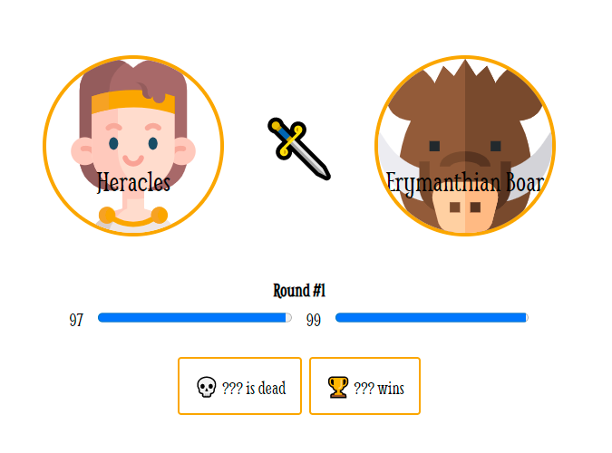
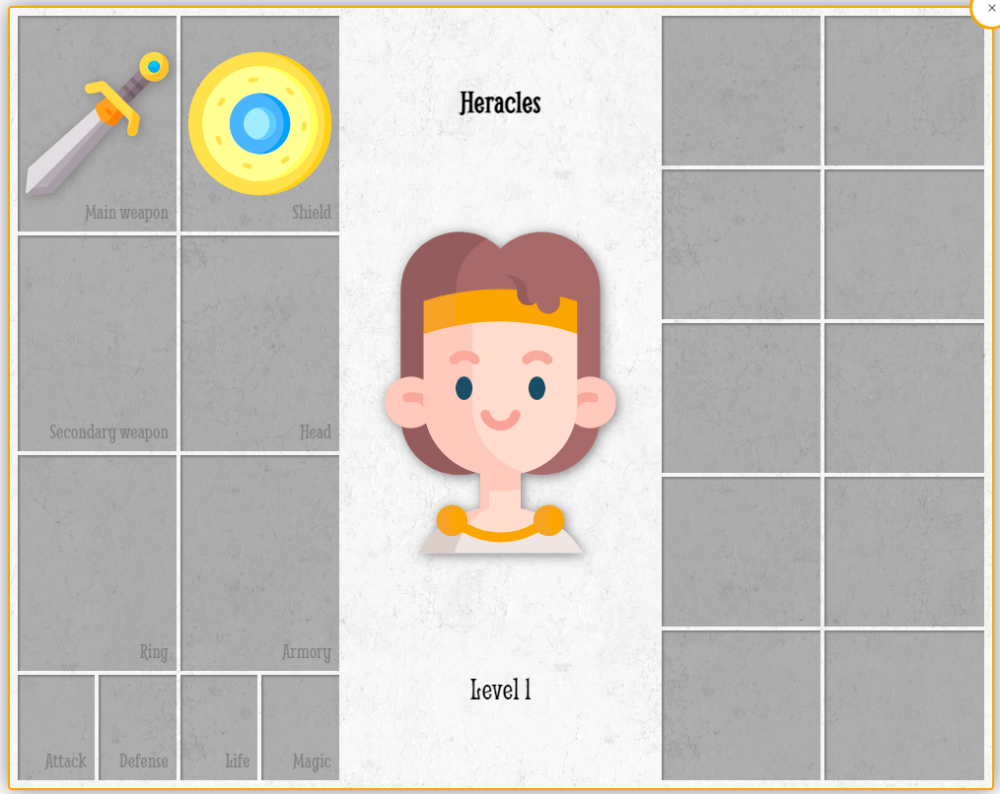

# The labours of Heracles - Second of the labours: the Erymanthian boar

Prerequisite: clone this _repository_.

## Introduction

Heracles has now to defeat the Erymanthian boar 🐗! A giant beast that terrifies Arcadian people.

And now, you will have to render the fight in the browser, not in the console anymore.

When you open `index.html` in your browser with [Live Server](https://marketplace.visualstudio.com/items?itemName=ritwickdey.LiveServer) you should see the arena.



## Mission 1: Render the fight in the page

You have the fight logic coded but it renders the result in the console. Do some DOM manipulation to render it directly in the screen (cf `<section class="rounds">`). With some calls to `document.createElement()` and some calls to `append()` you should achieve it quite easily 😉.

## Mission 2: Give Heracles a chance to defeat the boar

Now that you have the fight rendered in the web page, you should see that Heracles has no chance to defeat the boar with his bare hands. Give him a chance to defeat the boar by activating weapon and shield feature.

In the `fighter.js` class, add two new properties to the fighter:

- weapon (that will be an object with a `damage` property)
- shield (that will be an object with a `protection` property)

In `index.js` file give Heracles a sword and a shield with 10 points of damage and protection.

```js
const sword = {damage: 10};
const shield = {protection: 10}
```

Add a `getDamage()` method to calculate the damage power of a fighter. If a fighter has no weapon, the damage power is only the fighter strength. Otherwise it is strength + damage points of the weapon.

Add a `getDefense()` method as well to calculate the protection power of a fighter. If a fighter has no shield, the protection power is only the fighter dexterity. Otherwiser it is dexterity + protection points of the shield.

Modify the `fight()` method to change the calculations. You should now use `getDamage()` and `getDefense()` instead of just `strength` and `dexterity`. You should still use `Math.random()` to calculate the damage points but now with the result of `getDamage()` method.

You should now see that Heracles is able to defeat the boar.

## Mission 3: Show and hide weapon and shield in GUI

If you click on Heracles avatar, you should see Heracles inventory.



That is nice, but it is hardcoded in the `index.html` file. Find a solution to handle this using JS objects. If Heracles has a sword, the image of the sword should show up, otherwise not. Same for the shield.

Once done, take care of the attack and defense slot as well and update those fields with the Hero attack and defense power numbers.

## Mission 4: Enable or disable items in GUI

Up to now, the weapon and the shield are hardcoded in the `index.js` file. To make the game a bit funnier for the gamer, add :

- A button to start the fight (and a listener to handle the `click` event that starts the fight). Or a button to restart the game if it already took place.
- Two listeners on the main weapon and shield image slots to enable or disable each of them.

Bonus : add a delay between each round to see the fight progression.
